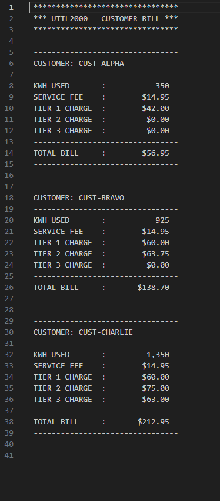

# UTIL2000 – COBOL Utility Billing System

## 👨‍💻 Author
Dhruv Patel  
CIS 352 – Intro to Enterprise Computing  
Spring 2026  

GitHub Repository:  
https://github.com/dhruvpatel21072002-art/COBOL-UTIL1000  

---

## 📌 Project Overview

UTIL2000 is a COBOL program developed and executed on an IBM mainframe using ISPF and SDSF.

The program calculates monthly utility bills for three predefined customers using a tiered kilowatt-hour (kWh) billing structure. Each customer's total includes tiered usage charges and a fixed service fee.

This project demonstrates structured COBOL program design, modular paragraph organization, conditional logic, and formatted financial output.

---

## ⚙️ Billing Structure

| Tier | Usage Range | Rate per kWh |
|------|------------|--------------|
| Tier 1 | 0 – 500 kWh | $0.12 |
| Tier 2 | 501 – 1000 kWh | $0.15 |
| Tier 3 | 1001+ kWh | $0.18 |

Service Fee: $14.95 per customer

---

## 🧾 Customers Processed

- CUST-ALPHA – 350 kWh
- CUST-BRAVO – 925 kWh
- CUST-CHARLIE – 1350 kWh

Each customer is processed sequentially using structured PERFORM logic.

---

## 🔍 How the Program Works

1. Loads predefined customer data from WORKING-STORAGE
2. Determines kWh distribution across billing tiers
3. Calculates tier charges using COMPUTE with ROUNDED
4. Calculates subtotal and total bill
5. Displays formatted results using edited numeric fields

---

## 🖥️ Sample Program Output

---

## 🧠 Concepts Demonstrated

- Structured WORKING-STORAGE data grouping
- Multi-customer processing without tables
- Nested IF logic for tier calculation
- COMPUTE statement with ROUNDED
- Edited numeric formatting (Z and $ patterns)
- Modular paragraph design
- Sequential program control using PERFORM
- Mainframe development using ISPF and SDSF

---

## 💻 Development Environment

- IBM Mainframe
- TN3270 Terminal Emulator
- ISPF Editor
- SDSF Job Control
- JCL Compilation

---

## 📈 What I Learned

This assignment strengthened my understanding of structured COBOL programming, tier-based business logic implementation, and professional mainframe workflow. I also gained experience troubleshooting mainframe file locking and enqueue errors during development.

---

## 🔗 Author Links

GitHub:  
https://github.com/dhruvpatel21072002-art

---

## 📋 Self Review

### Good
The program correctly calculates tiered billing for multiple customers and produces clean, formatted output.

### Bad
Understanding mainframe dataset locking and enqueue errors required additional troubleshooting time.

### Ugly
Debugging nested tier logic required careful validation to ensure accurate charge distribution for high-usage customers.

---

